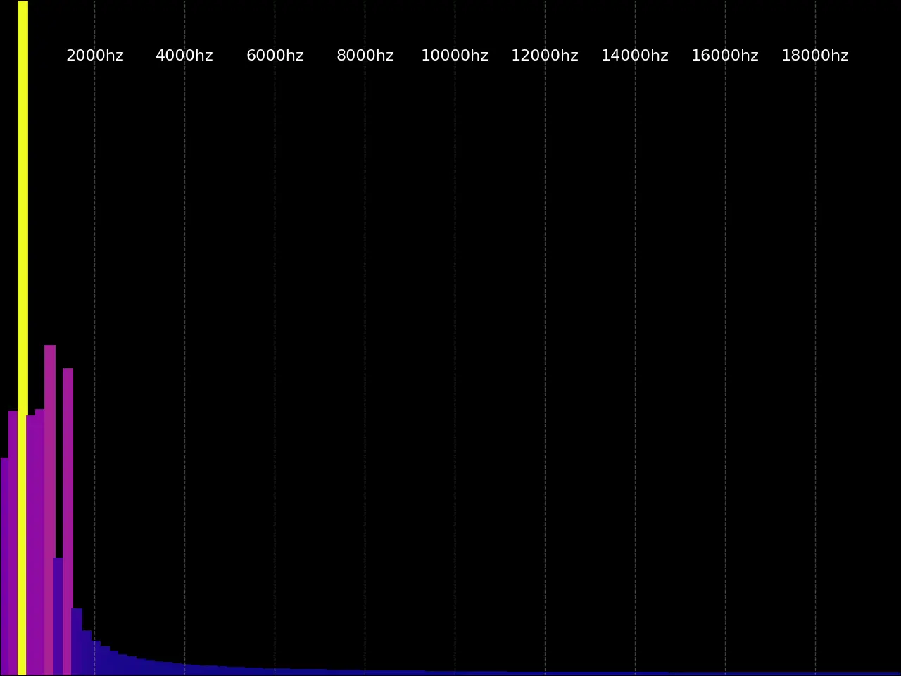

<!-- @import "[TOC]" {cmd="toc" depthFrom=1 depthTo=6 orderedList=false} -->
# Audio Visualizer



A Python application that creates real-time audio visualization by analyzing live microphone input and displaying frequency spectrum data as an animated bar chart.

## Overview

This project provides a visual representation of audio frequencies using matplotlib. It captures live audio from your microphone, performs FFT (Fast Fourier Transform) analysis, and displays the magnitude of different frequency bands in real-time with color-coded bars.

## Features

- **Real-time Audio Capture**: Streams audio directly from your selected audio device
- **Frequency Analysis**: Uses FFT to decompose audio into frequency bands
- **Live Visualization**: Animated bar chart that updates as audio is captured
- **Customizable Frequency Range**: Set any frequency range (default: 0-20,000 Hz)
- **Adjustable Parameters**:
  - Number of frequency bands
  - Update interval (refresh rate)
  - Gain/amplification factor
  - Color gradient/colormap
  - Audio device selection
  - Sample rate configuration
- **Device Listing**: Built-in utility to list all available audio devices
- **GIF Export**: Save animations as GIF for demos and documentation
- **Test Mode**: Generate test visualizations without microphone input

## Requirements

- Python 3.13+
- NumPy
- Matplotlib
- SoundDevice

## Installation

1. Clone the repository:
```bash
git clone https://github.com/syntaxDuck/audio-visualizer.git
cd audio-visualizer
```

2. Install `uv` (if needed):
```bash
curl -LsSf https://astral.sh/uv/install.sh | sh
```

3. Install system audio prerequisites:
- **macOS** (Homebrew):
  ```bash
  brew install portaudio
  ```
- **Ubuntu/Debian**:
  ```bash
  sudo apt-get update
  sudo apt-get install -y portaudio19-dev
  ```
- **Windows**:
  PortAudio is bundled through Python wheels in most setups.

4. Sync dependencies:
```bash
uv sync
```

## Usage

### Main Application

Run the main visualizer:
```bash
uv run python main.py
```

### Command-Line Arguments

- **`-d, --device DEVICE`** (Optional)
  - Input device: numeric ID or substring of device name
  - If omitted, uses the OS default input device
  - Use `-l` to list available devices

- **`-l, --list-devices`**
  - Display all available audio devices and exit

- **`-s, --samplerate SAMPLERATE`**
  - Sampling rate in Hz
  - Default: device's native sample rate

- **`-i, --interval INTERVAL`**
  - Graph update interval in milliseconds
  - Default: 30 ms

- **`-o, --output OUTPUT`**
  - Output GIF filename (saves animation and exits)
  - Use with `--test-mode` for testing without microphone
  - Example: `-o demo.gif`

- **`--duration DURATION`**
  - Recording duration in seconds for GIF output
  - Default: 10 seconds

- **`--test-mode`**
  - Use synthetic sine wave audio instead of microphone
  - Useful for testing without audio input device

- **`-r, --range LOW HIGH`**
  - Frequency range in Hz (e.g., `-r 20 20000`)
  - Default: 0 20000 Hz

- **`-g, --gain GAIN`**
  - Initial gain/amplification factor
  - Default: 10

- **`-b, --bands BANDS`**
  - Number of frequency bands to display
  - Default: 100

- **`--cmap COLORMAP`**
  - Color gradient for the bars
  - Examples: plasma (default), viridis, cool, hot, jet
  - See matplotlib colormaps for all options

### Examples

List available audio devices:
```bash
uv run python main.py -l
```

Visualize audio from device 2 with custom range:
```bash
uv run python main.py -d 2 -r 100 5000 -b 50
```

Visualize with different colormap and gain:
```bash
uv run python main.py -d "Microphone" -g 15 --cmap viridis
```

Faster update rate for real-time response:
```bash
uv run python main.py -d 0 -i 30
```

### GIF Generation

Generate a GIF animation of the visualizer (useful for demos or documentation):

```bash
# Generate test GIF (no microphone needed)
uv run python main.py --test-mode -o demo.gif

# Record from microphone
uv run python main.py -d 0 -o live.gif --duration 10

# Custom settings
uv run python main.py --test-mode -o custom.gif --duration 5 -b 50 --cmap viridis
```

## Example Scripts

The `examples/` directory contains alternative visualization approaches:

### `sounddevice_rt_plot_device.py`
Plots live waveform data from the microphone input in real-time. Shows the audio signal amplitude over time rather than frequency content.

**Usage:**
```bash
uv run python examples/sounddevice_rt_plot_device.py
```

### `sounddevice_rt_spectrogram.py`
Displays a text-mode spectrogram in the terminal showing frequency content over time using ASCII characters.

**Usage:**
```bash
uv run python examples/sounddevice_rt_spectrogram.py
```

## How It Works

1. **Audio Input**: Captures audio frames from the selected device using SoundDevice
2. **FFT Analysis**: Applies Fast Fourier Transform to convert time-domain audio to frequency domain
3. **Bin Selection**: Extracts frequency bins corresponding to the specified range
4. **Normalization**: Normalizes magnitudes for visualization
5. **Color Mapping**: Maps normalized values to colors using the selected colormap
6. **Display**: Updates matplotlib bar chart in real-time

## Architecture

- **main.py**: Core visualization application with matplotlib-based bar chart display
- **examples/**: Reference implementations using different visualization methods
- **pyproject.toml / uv.lock**: Dependency and environment management with uv

## Customization

The visualization can be customized by modifying:
- `main.py` directly for permanent changes
- Command-line arguments for per-session changes

Key parameters to adjust:
- `args.bands`: Number of frequency bands (affects detail level)
- `args.gain`: Amplification of frequency magnitudes
- `args.cmap`: Color scheme for visual aesthetics
- `args.interval`: Update speed (lower = faster, more CPU intensive)

## Performance Considerations

- Increasing the number of bands or decreasing the update interval increases CPU usage
- FFT size is calculated automatically based on desired frequency resolution
- Lower frequency ranges allow for better frequency resolution at the cost of bandwidth

## Troubleshooting

**No audio input detected:**
- Verify the correct device ID using `-l` flag
- Check device is not in use by another application
- Ensure microphone is not muted

**Visualization is slow or choppy:**
- Increase the interval value (e.g., `-i 100`)
- Reduce the number of bands
- Close other CPU-intensive applications

**Audio level is too low/high:**
- Adjust the gain with `-g` parameter
- Check system volume and device input levels

## License

This project is maintained by syntaxDuck.

## Contributing

Feel free to submit issues and enhancement requests!
